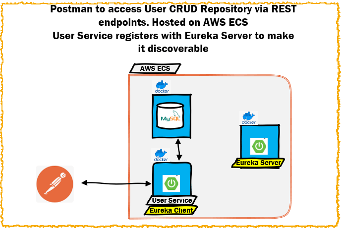

# RnRAlbumArt - Microservices Project

The high-level objective of this project is to build and deploy a Microservices application to the public cloud (AWS) and in the process demonstrate
* key concepts
* Microservices Architecture concerns/possible solutions
* best practices
* CaaS - the model for deployment will be Containers as a Service


The RnRAlbumArt - Micrososervices Project will be built over a number of iterations with each iteration highlighting and addressing a particular concern.

## Iteration  - 4 - Objectives

* Refactor as a Multi-Module Maven Project
* Implement Eureka Discovery Server - Service
* Dockerise the Eureka Discovery Server
* Register User service as a client



At the end of this Iteration, should be able to :

* when the User Service starts, it should register itself with the Eureka Server and this can be observed from the Eureka dashboard endpoint


### Setting up a Eureka Server


Annotate the application

Set up application.yml for the Eureka Server


### Configuring the User service as Eureka Client


### Establishing a Multi-Module Maven project

Create a Parent POM

Add User-Service and Eureka-Service as modules

```xml
xsi:schemaLocation="http://maven.apache.org/POM/4.0.0 http://maven.apache.org/xsd/maven-4.0.0.xsd">
<modelVersion>4.0.0</modelVersion>

<parent>
  <groupId>org.springframework.boot</groupId>
  <artifactId>spring-boot-starter-parent</artifactId>
  <version>2.7.4</version>
  <relativePath/> <!-- lookup parent from repository -->
</parent>

<groupId>org.example</groupId>
<artifactId>RnRAlbumArtMultiModule</artifactId>
<version>1.0-SNAPSHOT</version>
<packaging>pom</packaging>

<name>RnRAlbumArtMultiModule</name>
<url>http://maven.apache.org</url>
  <modules>
      <module>user-service</module>
    <module>eureka-service</module>
  </modules>
```


### Using AWS EKS to orchestrate the Docker containers startup

The Discovery Server should start first

The Discovery Client should start next and register with Discovery Server

User Service endpoints should be available to make CRUD operations to the mySQL database in the Docker container


