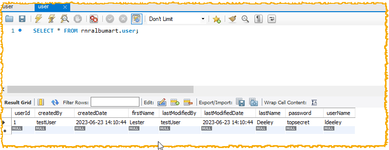
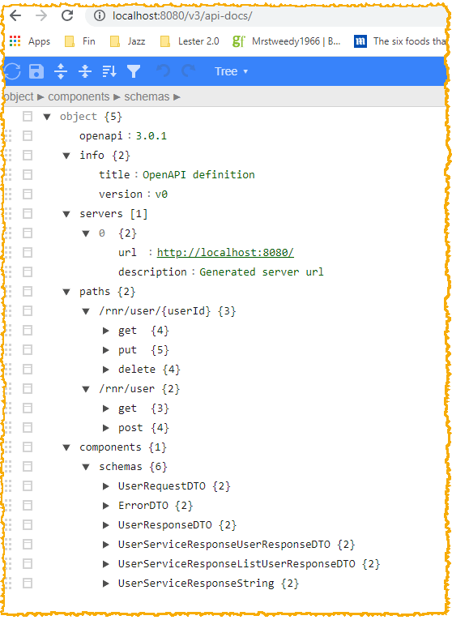
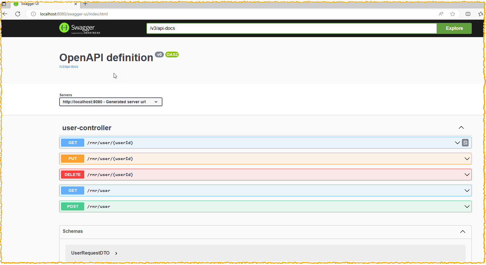
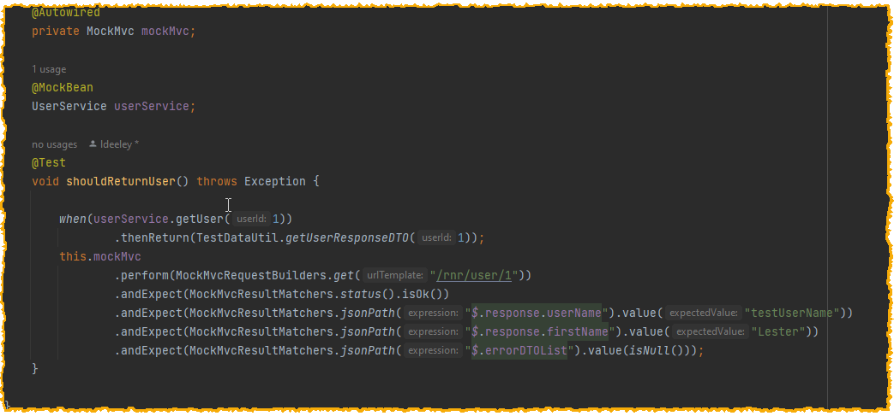

# RnRAlbumArt - Microservices Project

The high-level objective of this project is to build and deploy a Microservices application to the public cloud (AWS) and in the process demonstrate
* key concepts
* Microservices Architecture concerns/possible solutions
* best practices
* CaaS - the model for deployment will be Containers as a Service


The RnRAlbumArt - Micrososervices Project will be built over a number of iterations with each iteration highlighting and addressing a particular concern.

## Iteration  - 3 - Objectives

* Implement Auditing to audit updates to User table
* Implement Documentation for REST endpoints
* Implement Spring profiles (configuration externalised later)
* 12-Factor App [ 6. Logging] (first phase only)
* Expand Test Cases


At the end of this Iteration, should be able to :

* use interactive documentation on REST endpoints
* see auditing in User tables

### Auditing

Add annotations to User entity POJO


Add an AuditorAware implementation. This will be enhanced later when Spring Boot Security is implemented to get the actual logged in User


Enable the Spring Data JPA Auditing. Create a Bean 


Check database for Audit fields. This will be built out further when Spring Boot Security implemented in later iteration.



### Documentation of REST Endpoints

 - The Spring Boot app at this stage has WebLayer - RestController with endpoints

* GET
* POST
* PUT
* DELETE

Add OpenAPI dependency to POM.xml

```xml
<dependency>
    <groupId>org.springdoc</groupId>
    <artifactId>springdoc-openapi-ui</artifactId>
    <version>1.6.15</version>
</dependency>
```

Generates documentation





Use the Swagger ui to test REST Endpoints

 - The GitHub repo is [https://github.com/ldeeley/RnRAlbumArt](https://github.com/ldeeley/RnRAlbumArt)


### Logging

Using the Lombok @Slf4j annotation, implement logging in the Service Layer and Controller Layer. Collection of Logs (later iteration)


### Testing

Unit Tests



